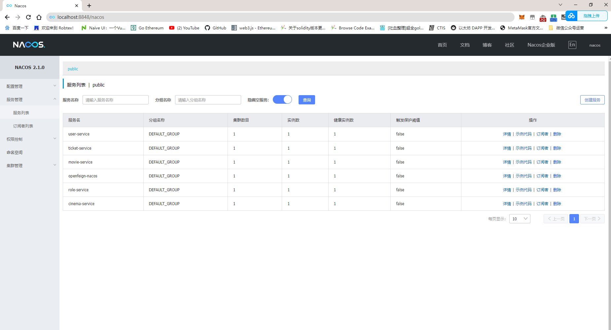
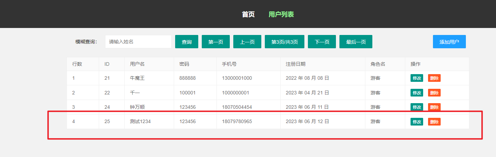

# 																													SpringCloudProject

## 一、项目简介

1. 基于**SpringCloud Alibab**，包含一个**注册中心**，一个**公共项目**，没有使用**Gateway**，存在**多个资源服务**，前端较为简单，包含六张数据库表，
   所有控制器饭会类型统一封装为了工具类，后端合前端交互数据传输不仅只有实体类，前端用的是**前后端不分离的框架**,前端依赖于后端,所以没法使用gateway,但是在代码上,将服务端分为多个服务,同时也有**负载均衡**的能力，是一个关于电影票购票及管理的系统。
2. 运行环境
   1. 设备名称	LAPTOP-7FEE9KK7
      处理器	AMD Ryzen 5 4500U with Radeon Graphics            2.38 GHz
      机带 RAM	16.0 GB (15.4 GB 可用)
   2. IntelliJ IDEA 2020.1 x64
   3. JDK1.8
   4. 1.8 java version "1.8.0_351"
   5. apache-maven-3.6.3
   6. nacos-server-2.1.0

## 二、数据库设计

包含：电影院表、电影表、电影和电影的关联表、角色表、电影票表、用户表。

### 1、影院表

```mysql
DROP TABLE IF EXISTS `cinema`;
CREATE TABLE `cinema`  (
  `c_id` int(11) NOT NULL COMMENT '影院主键',
  `c_name` varchar(50) CHARACTER SET utf8mb4 COLLATE utf8mb4_0900_ai_ci NULL DEFAULT NULL COMMENT '影院名称',
  `c_phone` varchar(50) CHARACTER SET utf8mb4 COLLATE utf8mb4_0900_ai_ci NULL DEFAULT NULL COMMENT '联系方式',
  `c_address` varchar(50) CHARACTER SET utf8mb4 COLLATE utf8mb4_0900_ai_ci NULL DEFAULT NULL COMMENT '影院地址',
  `c_date` date NULL DEFAULT NULL COMMENT '首营业日期',
  PRIMARY KEY (`c_id`) USING BTREE
) ENGINE = InnoDB CHARACTER SET = utf8mb4 COLLATE = utf8mb4_0900_ai_ci ROW_FORMAT = Dynamic;
```

### 2、电影表

```mysql
DROP TABLE IF EXISTS `movie`;
CREATE TABLE `movie`  (
  `m_id` int(11) NOT NULL COMMENT '电影主键',
  `m_name` varchar(50) CHARACTER SET utf8mb4 COLLATE utf8mb4_0900_ai_ci NULL DEFAULT NULL COMMENT '电影名',
  `m_date` date NULL DEFAULT NULL COMMENT '上映日期',
  `m_country` varchar(50) CHARACTER SET utf8mb4 COLLATE utf8mb4_0900_ai_ci NULL DEFAULT NULL COMMENT '上映国家',
  PRIMARY KEY (`m_id`) USING BTREE
) ENGINE = InnoDB CHARACTER SET = utf8mb4 COLLATE = utf8mb4_0900_ai_ci ROW_FORMAT = Dynamic;
```

### 3、影院和电影票关联表

```mysql
DROP TABLE IF EXISTS `movie_cinema`;
CREATE TABLE `movie_cinema`  (
  `mc_movie_id` int(11) NULL DEFAULT NULL COMMENT '电影外键',
  `mc_cinema_id` int(11) NULL DEFAULT NULL COMMENT '影院外键'
) ENGINE = InnoDB CHARACTER SET = utf8mb4 COLLATE = utf8mb4_0900_ai_ci ROW_FORMAT = Dynamic;
```

### 4、角色表

```mysql
DROP TABLE IF EXISTS `role`;
CREATE TABLE `role`  (
  `r_id` int(11) NOT NULL COMMENT '角色主键',
  `r_name` varchar(50) CHARACTER SET utf8mb4 COLLATE utf8mb4_0900_ai_ci NULL DEFAULT NULL COMMENT '角色名',
  PRIMARY KEY (`r_id`) USING BTREE
) ENGINE = InnoDB CHARACTER SET = utf8mb4 COLLATE = utf8mb4_0900_ai_ci ROW_FORMAT = Dynamic;
```

### 5、电影票表

```mysql
DROP TABLE IF EXISTS `ticket`;
CREATE TABLE `ticket`  (
  `t_id` int(11) NOT NULL AUTO_INCREMENT COMMENT '电影票主键',
  `t_movie` int(11) NULL DEFAULT NULL COMMENT '电影外键（getName）',
  `t_cinema` int(11) NULL DEFAULT NULL COMMENT '电影院外键（getName）',
  `t_date` date NULL DEFAULT NULL COMMENT '购买时间',
  `t_user` int(11) NULL DEFAULT NULL COMMENT '购买者外键（getName）',
  PRIMARY KEY (`t_id`) USING BTREE
) ENGINE = InnoDB AUTO_INCREMENT = 15 CHARACTER SET = utf8mb4 COLLATE = utf8mb4_0900_ai_ci ROW_FORMAT = Dynamic;
```

### 6、用户表

```mysql
DROP TABLE IF EXISTS `user`;
CREATE TABLE `user`  (
  `u_id` int(11) NOT NULL AUTO_INCREMENT COMMENT '用户主键',
  `u_username` varchar(50) CHARACTER SET utf8mb4 COLLATE utf8mb4_0900_ai_ci NULL DEFAULT NULL COMMENT '用户名',
  `u_password` varchar(50) CHARACTER SET utf8mb4 COLLATE utf8mb4_0900_ai_ci NULL DEFAULT NULL COMMENT '密码',
  `u_phone` varchar(50) CHARACTER SET utf8mb4 COLLATE utf8mb4_0900_ai_ci NULL DEFAULT NULL COMMENT '电话',
  `u_date` date NULL DEFAULT NULL COMMENT '创建日期（不可修改）',
  `u_role_id` int(11) NULL DEFAULT NULL COMMENT '角色外键',
  PRIMARY KEY (`u_id`) USING BTREE
) ENGINE = InnoDB AUTO_INCREMENT = 24 CHARACTER SET = utf8mb4 COLLATE = utf8mb4_0900_ai_ci ROW_FORMAT = Dynamic;
```

## 三、部署步骤

### 1、数据库导入


### 2、项目导入


### 3、配置maven


### 4、配置java


### 5、项目数据库配置修改


### 6、项目启动


## 四、项目技术要求


## 五、服务

### 1、MovieServiceApplication


### 2、OpenFeignApplication


### 3、RoleServiceApplication


### 4、TicketsServiceApplication


### 5、UserServiceApplication


### 6、CinemsaServiceApplication


## 六、配置和微服务管理

### 1、Nacos

（先启动Nacos，再去启动服务）


### 2、微服务管理

（注意可能刚进入的时候服务显示为空，只需要点击查询，刷新一下就可以了）



## 七、用户使用手册

### 																				**未登录状态**

### 1、进入主页

（浏览器地址栏输入：http://localhost:6969/）


### 2、影院列表页


### 3、影院列表切换下一页


### 4、查看某个电影院上映的电影


### 5、模糊查询电影院名称


### 6、电影列表页


### 7、电影列表页切换下一页


### 8、电影模糊查询


### 9、用户登录页


### 10、用户注册页		


### 																	普通用户登录注册

### 1、用户注册并实现注册成功自动登录


### 2、用户进行购票

（先选择电影名称）


（再选择影院）


（点击付款，会直接付款成功，并且生成电影票相关信息）


### 3、用户个人信息

（密码没有加密，可以进行修改）


## 															管理员登录管理

### 1、切换身份登录


区别于普通游客登录


### 2、用户购票详情清单


（这是刚才用户登录以后购买的记录）


### 3、用户列表


（点击修改用户信息之后进入用户信息修改，可以修改用户的基本信息和身份）


### 4、用户删除


（删除后自动刷新并且不再显示）


（删除以后不能登录）


### 5、管理员添加用户


（添加成功）



### 6、管理员修改基本信息

（修改基本信息不能修改自己的身份）


